<p align="center">
  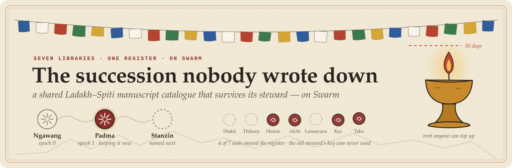
</p>

<p align="center">
  <a href="https://github.com/Tan0610/p3-succession/actions/workflows/ci.yml"></a>
  <a href="https://github.com/Tan0610/p3-succession/actions/workflows/steward-watchdog.yml"></a>
  <a href="HANDOFF_LOG.md"></a>
  <a href="test"></a>
  <br>
  
  
  
  
  <a href="LICENSE"></a>
</p>

Seven monastery libraries across Ladakh and Spiti share one manuscript catalogue. For nine years one man, Ngawang Dorje, renewed its storage, held the only key that could publish it, and typed in everyone's corrections. This repository is the arrangement that lets the catalogue outlive him, and whoever comes after him. It is written down for the committees in **[STEWARDSHIP.md](STEWARDSHIP.md), the agreement the seven committees sign**, and it was **performed live on Swarm on 2026-09-19**.

**Contents:** [60-second tour](#60-second-tour) · [Verify without us](#verify-without-us) · [What the judge checks](#what-the-judge-checks) · [If Ngawang stops answering tomorrow](#if-ngawang-stops-answering-tomorrow) · [How it works](#how-it-works) · [Screenshots](#screenshots) · [The daily watchdog](#the-daily-watchdog) · [Run it](#run-it) · [Honest limits](#honest-limits)

## 60-second tour

- **One address that never moves.** Readers start from a register feed owned by the council scribe (`0xB3959e06…B0a64af0`, topic `lsc/registry/v1`, manifest `37eff4d5…12c291f2`). Update #0 named Ngawang. Update #1 names **Padma Chodon**, who named **Stanzin Namgyal** as next. Same address before and after.
- **Nobody changes the steward alone.** Epoch 1 moved on 4 of 7 library seals (Hemis, Alchi, Tabo, Kye) plus Padma's own signature. Ngawang's key was **not** used. Every reader re-counts the seals, so not even the scribe can redirect them.
- **Two attempts were refused first**, during the live ceremony: the outgoing steward signing for Hemis (0 valid seals of 4), then only 3 of 7 libraries (3 of 4). Both are in the evidence file.
- **Corrections without the steward.** Tabo and Kye signed corrections onto their own feeds. Padma's first catalogue (v2) applied Tabo's correction to its own shelf and kept Kye's note about a Hemis work as a proposal for Hemis.
- **Rent extended, not only bought.** `storage extend` took batch `65c1e843…a6038c` from **14 → 15 days** for 0.0468 xBZZ ([STORAGE_LOG.md](STORAGE_LOG.md)). Topping up is permissionless, so any library can do it from its own wallet.
- **Watched every day, in public.** A keyless GitHub Action re-reads all of this daily. The demo batch sits under the charter's 30-day floor, so trigger T3 is met and the watchdog [opened issue #1](https://github.com/Tan0610/p3-succession/issues/1) with the top-up recipe. That is the arrangement working as written.

<!-- lsc:status -->
**Status:** performed live on a Bee node, not only rehearsed.

- Epoch 1, 2026-09-19: Ngawang Dorje → **Padma Chodon** `0x9e9e0Cd098e4492bfC6889014d48936eE01a3720`, register update #1, evidence [handoffs/2026-09-19-epoch-1.json](handoffs/2026-09-19-epoch-1.json)
<!-- /lsc:status -->

## Verify without us

No keys, no node of ours, no trust in our code. Two `curl`s against a public gateway:

```sh
# the register's latest entry (JSON): who the steward is, and the seals that put them there
curl https://api.gateway.ethswarm.org/bzz/37eff4d56efe327da23b92cf60a692677053a854903a8e7f205cea3a12c291f2/

# the catalogue from the steward that entry names (Padma Chodon's feed)
curl https://api.gateway.ethswarm.org/bzz/f612ba148b7fbd9dfa4126d6876963b7c02207884b385f732256441dd214d2fc/catalogue.json
```

Or let our reader do the careful walk (after `npm ci`; still keyless, all GETs):

```sh
npm run cli -- read --bee https://api.gateway.ethswarm.org        # register → re-counted seals → Padma → catalogue v2
npm run verify:handoff -- handoffs/2026-09-19-epoch-1.json --bee https://api.gateway.ethswarm.org
npm run watchdog                                                  # reachable? paid for? steward still publishing?
```

Expected from `read`: `2 update(s), 2 valid` · `#1 ok epoch 1 → Padma Chodon … (4/4 seals)` · `Catalogue v2 from Padma Chodon's feed #0`. The byte layout for walking the feed by hand, and how to check a seal with any wallet (`cast wallet verify`), are in [docs/READ_WITHOUT_US.md](docs/READ_WITHOUT_US.md).

<!-- lsc:anchor -->
```
registry owner (council scribe) : 0xB3959e06E1edE30605Ed3136C857cC57B0a64af0
registry topic                  : lsc/registry/v1
registry topic (hex)            : f17e2832a227f4efaf7867e0d8f9ba14fa070ef851fb46967eb51c77a4b88a6d
registry feed manifest          : 37eff4d56efe327da23b92cf60a692677053a854903a8e7f205cea3a12c291f2
catalogue topic                 : lsc/catalogue/v1  (5585bf7626ca42b72333dfda4e6a6bf7118861a23e4e2b026a727e0e9db1249f)
corrections topic               : lsc/corrections/v1  (2cf9be53bb7408cee80ea7678ddcb7700e4ae3167670105625954316124ee633)
postage batch (open to top-ups) : 65c1e84317fa4a5f469bd5b53180edaab7c2fc7fa5d66b4c2bbe86a749a6038c
```
<!-- /lsc:anchor -->

## What the judge checks

The eight official test cases, word for word, with where each is met and the live evidence. Every code pointer is `file` › `function`; the full code-path table is under [How each check is met](#how-each-check-is-met).

| # | Test case (verbatim) | Pts | Where it is met | Live evidence |
|---|---|---:|---|---|
| 1 | Readers reach current content through an indirection that survives a change of publisher | 20 | [`src/core/resolve.ts`](src/core/resolve.ts) › `readRegistry()` → `checkEntry()` → `readCatalogue()` → `resolveAll()`; keyless [`HttpFeedStore`](src/core/http-feedstore.ts); `curl` in [READ_WITHOUT_US](docs/READ_WITHOUT_US.md) | Registry manifest `37eff4d5…12c291f2` unchanged across feed index **#0** (Ngawang) → **#1** (Padma); `readersNowFollow: 0x9e9e…3720` in [epoch-1.json](handoffs/2026-09-19-epoch-1.json) |
| 2 | The identity that pays for storage and the identity that signs updates are configured separately | 12 | [`stewardship.config.json`](stewardship.config.json) › `payer.nodeAddress` + `payer.batchId`; signing keys in git-ignored `.secrets/` loaded by [`src/node/keys.ts`](src/node/keys.ts) › `loadIdentity()`; [`src/node/identities.ts`](src/node/identities.ts) › `assertIdentitiesSeparated()` | Payer `0x9452…9cb8` stamps; registry SOC `a9e6be18…` owned by scribe `0xB395…4af0`; catalogue signed by Padma `0x9e9e…3720`; `identitiesSeparated[]` lists all 12 roles |
| 3 | Storage is extended or topped up, not only purchased | 10 | `storage extend` → [`src/node/commands.ts`](src/node/commands.ts) › `storageExtend()` → [`src/node/storage.ts`](src/node/storage.ts) › `extendBatch()` (`bee.storage.extendDuration`); `storage topup` → `topUpBatch()`; permissionless `PostageStamp.topUp` recipe in [MECHANISMS](docs/MECHANISMS.md#topping-up-from-your-own-wallet-no-node-no-permission) | [STORAGE_LOG.md](STORAGE_LOG.md): 05:52 UTC `extend` +1 day, 0.0468 xBZZ, TTL **14 → 15** days on batch `65c1e843…`; also in [`ledger/storage.json`](ledger/storage.json) |
| 4 | A written arrangement names a successor and the condition that triggers succession | 10 | [STEWARDSHIP.md](STEWARDSHIP.md) §3 (`lsc:successor` block, rendered by [`src/node/config.ts`](src/node/config.ts) › `renderSuccessorBlock()`) and §4 (T1–T4) | Designated successor **Stanzin Namgyal** `0x906039f8…dE7C63`; triggers T1 step-down, T2 60 days silent + 2 libraries unanswered 30, T3 < 30 days storage, T4 5 of 7 ask |
| 5 | A hand-off that was actually performed is recorded | 10 | [`src/node/evidence.ts`](src/node/evidence.ts) › `writeHandoffRecord()` → [HANDOFF_LOG.md](HANDOFF_LOG.md) + `handoffs/*.json`; `npm run verify:handoff` | [Epoch 1](HANDOFF_LOG.md#epoch-1-ngawang-dorje--padma-chodon): registry feed index **#1**, entry `0d558b12…`, SOC `a9e6be18…`, Padma's acceptance `0x8e7d4a63…`, seals Hemis `0xad7abae4…` Alchi `0x9fc209f4…` Tabo `0xf0b841ae…` Kye `0xe1a8b4f4…` |
| 6 | The authority that can change who publishes is distinct from the publishing identity itself | 8 | Registry owned by the **council scribe**, not a steward; [`src/core/operations.ts`](src/core/operations.ts) › `performHandoff()` writes only with 4/7 seals (5/7 undesignated) + acceptance, via [`src/core/signatures.ts`](src/core/signatures.ts) › `verifyQuorum()`; readers re-check in `checkEntry()` | Scribe `0xB395…4af0` ≠ steward `0x9e9e…3720`; `rejectedAttempts[]` in [epoch-1.json](handoffs/2026-09-19-epoch-1.json): steward-signs-for-Hemis refused, 3-of-7 refused |
| 7 | No credential, private key, mnemonic, gift code or authenticated URL appears in any tracked file | 6 | [`.gitignore`](.gitignore) (`.secrets/`, `*.key`, `.env*`); [`src/node/keys.ts`](src/node/keys.ts) › `assertIgnored()`; [`src/node/audit.ts`](src/node/audit.ts) › `auditSecrets()` | `npm run audit:secrets` clean; runs in [CI](.github/workflows/ci.yml) via `npm run check` and in the test `the repository is clean` |
| 8 | The succession path takes the incoming steward's identity as a parameter | 4 | `succession handoff --incoming 0x…` → [`src/node/commands.ts`](src/node/commands.ts) › `handoff()` → `performHandoff({ incoming })`, refused on mismatch (`INCOMING_MISMATCH`); `ceremony --live --incoming` | `"suppliedAs": "--incoming 0x9e9e0Cd098e4492bfC6889014d48936eE01a3720"` in [epoch-1.json](handoffs/2026-09-19-epoch-1.json); test `--incoming must match the signed statement (no hardcoded successor)` |

### The brief, point by point

| The brief says (verbatim) | Where it is done |
|---|---|
| "Put the catalogue on Swarm, keep it readable, and keep its storage from lapsing." | Catalogue v1 (Ngawang) and v2 (Padma) are Swarm collections behind feeds; readable through any gateway ([Verify without us](#verify-without-us)). Storage extended 14 → 15 days ([STORAGE_LOG.md](STORAGE_LOG.md)), anyone can top up ([MECHANISMS](docs/MECHANISMS.md#topping-up-from-your-own-wallet-no-node-no-permission)), and the [watchdog](#the-daily-watchdog) raises T3 in public. |
| "Work out who holds what. Paying, publishing and deciding are not obviously the same party, find out for yourself which of them each mechanism you reach for can actually do." | [docs/MECHANISMS.md](docs/MECHANISMS.md): a table of each bee-js / PostageStamp mechanism and whether it can pay, publish or decide, checked against bee-js 13.1.0 and `PostageStamp.sol`. Summary in [Who holds what](#who-holds-what). |
| "Make succession real. Someone other than the original steward must be able to take over, and you must have actually done it within your team rather than described how you would." | Epoch 1, 2026-09-19: Padma Chodon took over from Ngawang Dorje on Swarm, on 4 of 7 seals, without Ngawang's key ([HANDOFF_LOG.md](HANDOFF_LOG.md)). This was a solo entry, so "within your team" means one builder holding eleven distinct keys; every evidence file says so in its `honesty` field. |
| "Write down the arrangement, in the repo, in language the seven committees could read and agree to." | [STEWARDSHIP.md](STEWARDSHIP.md): roles, the named successor, triggers T1–T4, the hand-off steps, corrections, rent, and what it cannot protect against, in plain language. |
| "Working on one shared node also means custody of the storage itself is not genuinely separated between you, every batch belongs to that node's key. Say so plainly in your write-up rather than implying otherwise." | Said plainly in [STEWARDSHIP.md §8](STEWARDSHIP.md#8-what-this-arrangement-cannot-protect-against), [Honest limits](#honest-limits), every `handoffs/*.json` `honesty` field, and the web viewer's footer. |
| **Deliverable:** "A GitHub repo containing the code, the written arrangement, and the record of the hand-off you actually performed." | Code: `src/`, `cli/`, `scripts/`, `web/`. Arrangement: [STEWARDSHIP.md](STEWARDSHIP.md). Record: [HANDOFF_LOG.md](HANDOFF_LOG.md) + [`handoffs/`](handoffs). |
| **Acceptance:** "Ngawang Dorje stops answering email and the catalogue is still reachable, still paid for, and still correctable by the other six." | Proven row by row in [If Ngawang stops answering tomorrow](#if-ngawang-stops-answering-tomorrow). |

### Who holds what

| Role | Public key | Pays | Publishes | Decides who publishes | Cannot |
|---|---|:-:|:-:|:-:|---|
| **Payer** (shared Bee node wallet) | `0x9452…9cb8` | ✓ | — | — | sign a catalogue or registry entry |
| **Steward** (Padma now; Stanzin next) | `0x9e9e…3720` | — | ✓ own feed | — | name their own replacement, move where readers look |
| **7 library committees** | 7 keys, [STEWARDSHIP §2](STEWARDSHIP.md#2-the-four-roles-and-what-each-one-cannot-do) | anyone may top up | own corrections only | ✓ 4 of 7 (5 of 7 undesignated) | act alone |
| **Council scribe** | `0xB395…4af0` | — | writes the register | records only what the seals decided | change the steward without seals (readers ignore it) |

## If Ngawang stops answering tomorrow

| The catalogue is still… | Because | See it |
|---|---|---|
| **reachable** | Readers start from the scribe's register, which never moves, and follow it to whichever steward the libraries sealed. No steward key, no node or software of ours: two `curl`s. | [Verify without us](#verify-without-us), [READ_WITHOUT_US](docs/READ_WITHOUT_US.md) |
| **paid for** | The rent lives in the PostageStamp contract on Gnosis Chain, not with Ngawang. `topUp` has no owner check, so any library tops up the batch from its own wallet; the node operator can run `storage extend`. | [MECHANISMS](docs/MECHANISMS.md#topping-up-from-your-own-wallet-no-node-no-permission), [STORAGE_LOG.md](STORAGE_LOG.md) |
| **correctable by the other six** | Each library signs corrections about its own shelves onto its own feed (`correction submit --as kye …`). Readers see them at once; the next steward applies them, and a note about another library's shelf stays a proposal for that library. | [STEWARDSHIP §6](STEWARDSHIP.md#6-correcting-the-catalogue-without-the-steward), epoch 1 follow-up in [HANDOFF_LOG.md](HANDOFF_LOG.md) |
| **run by someone else** | 4 of 7 seals and Padma's own acceptance moved the register to her. Ngawang's key was never used. | [HANDOFF_LOG.md](HANDOFF_LOG.md) epoch 1, `npm run verify:handoff` |
| **watched, even if nobody looks** | A keyless robot checks daily and opens one public issue when rent runs low or the steward goes quiet. | [The daily watchdog](#the-daily-watchdog), [issue #1](https://github.com/Tan0610/p3-succession/issues/1) |

## How it works

### What a reader does

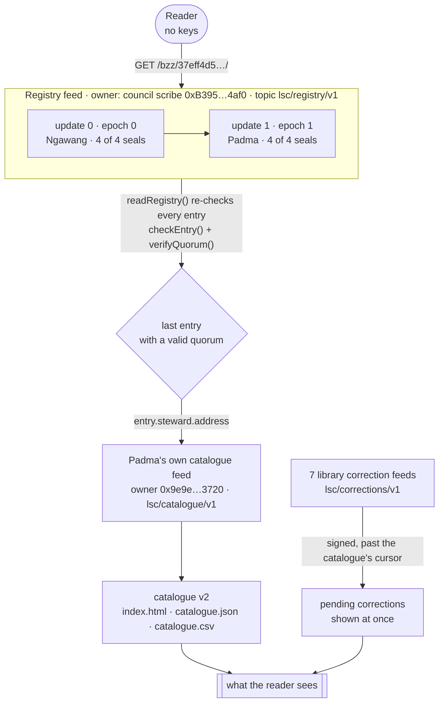

Every chunk is **stamped** by the payer's batch (node wallet) but **signed** by the role's own key. An entry the scribe writes without seals is skipped by every reader (test: `an entry the scribe writes without seals is ignored by readers`).

### How the steward changed (epoch 1, performed live)

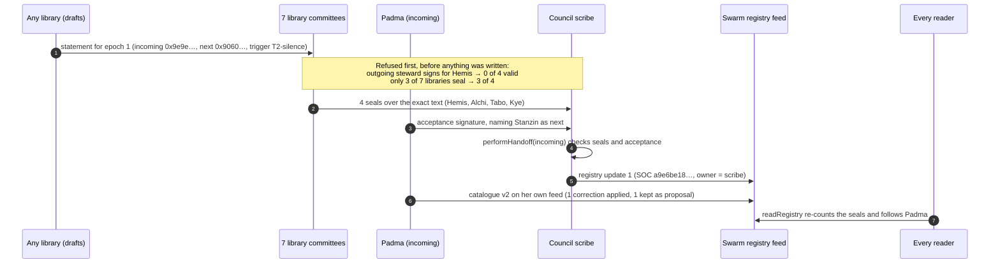

### The day it happened

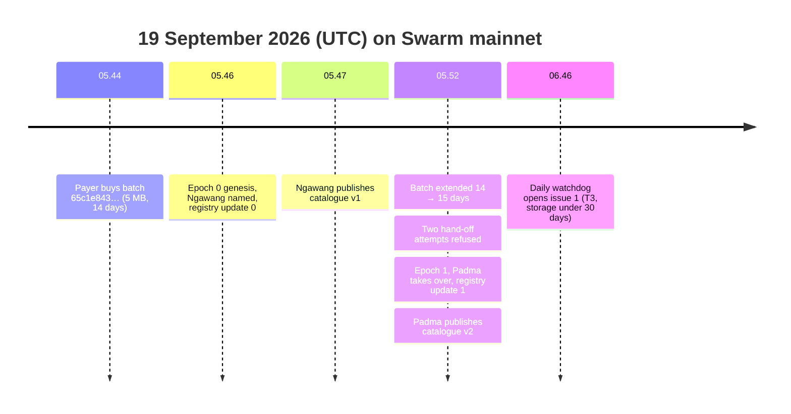

## Screenshots

The read-only web viewer (`npm run dev:web`), reading the live register from the Bee node after the hand-off. It holds no keys and checks every seal itself. Captured 2026-09-19.

<table>
  <tr>
    <td width="50%">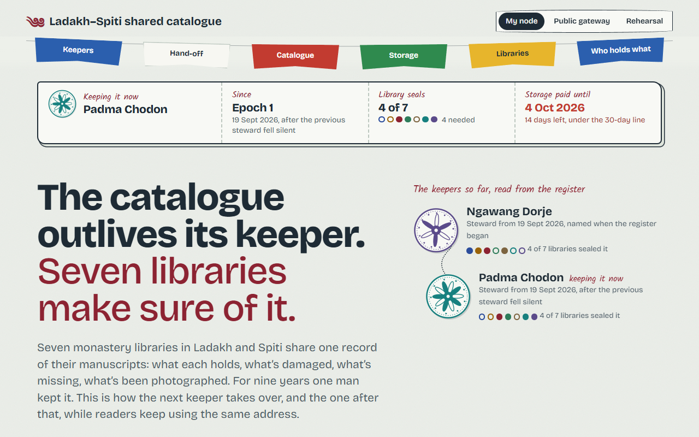<br><sub><b>Keepers.</b> The lineage read from the register: Ngawang, then Padma “keeping it now”, each with the seals that put them there.</sub></td>
    <td width="50%">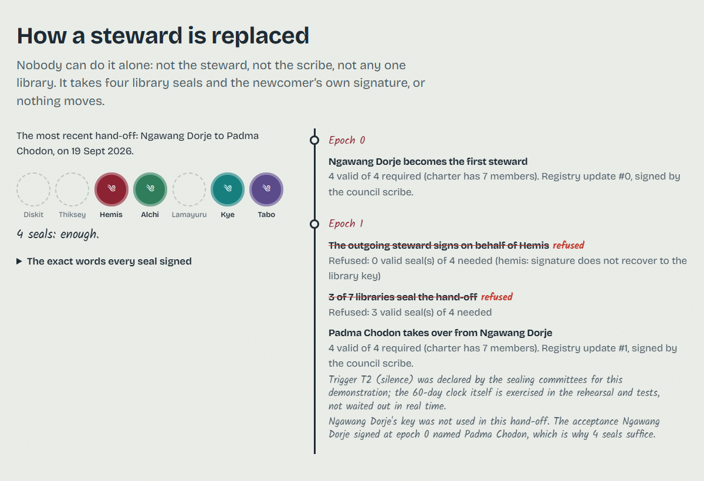<br><sub><b>Hand-off.</b> The four seals that moved epoch 1, and the two refused attempts, struck through.</sub></td>
  </tr>
  <tr>
    <td>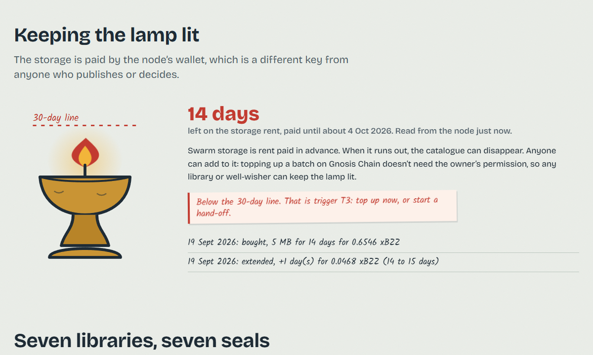<br><sub><b>Keeping the lamp lit.</b> Days of rent left, read from the node, under the 30-day line (T3), with the buy and extend ledger.</sub></td>
    <td>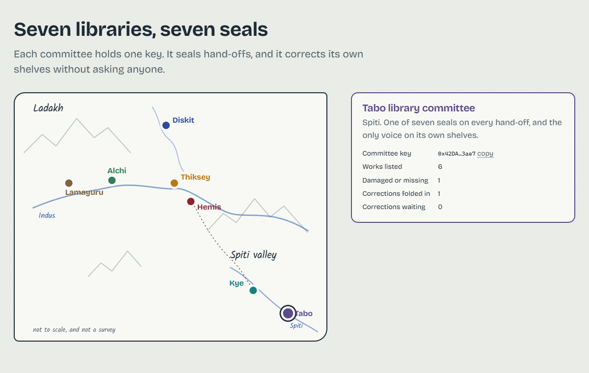<br><sub><b>Seven libraries.</b> Each committee's key, works, and corrections folded in or waiting.</sub></td>
  </tr>
  <tr>
    <td>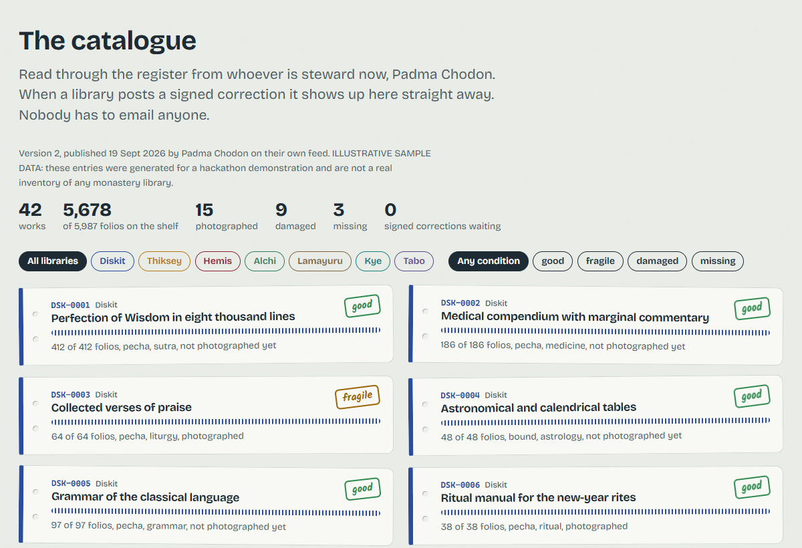<br><sub><b>The catalogue.</b> v2 from Padma's feed (illustrative sample data), filterable by library and condition.</sub></td>
    <td>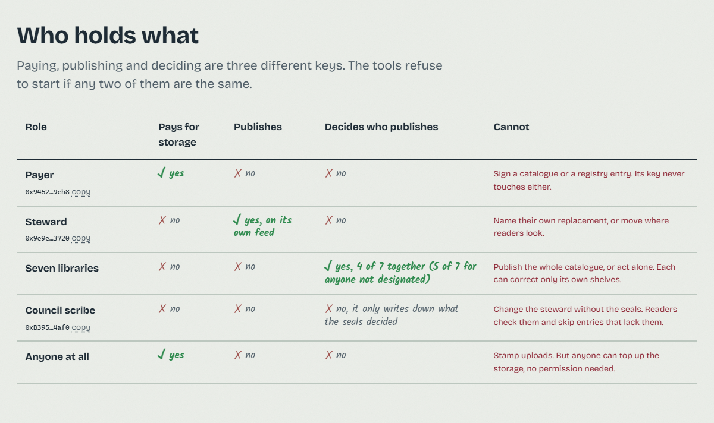<br><sub><b>Who holds what.</b> Paying, publishing and deciding, and what each role cannot do.</sub></td>
  </tr>
</table>

<details>
<summary><b>On a phone (375 px)</b></summary>

<p>
  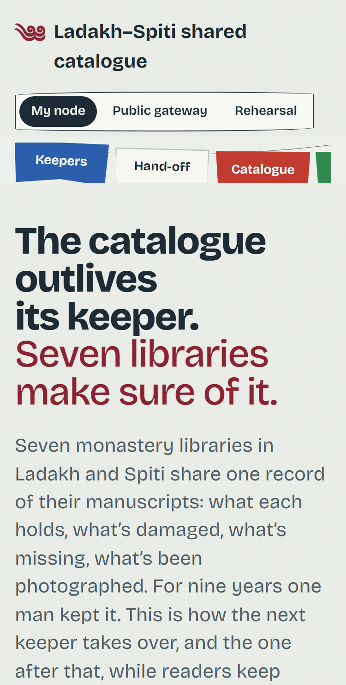
  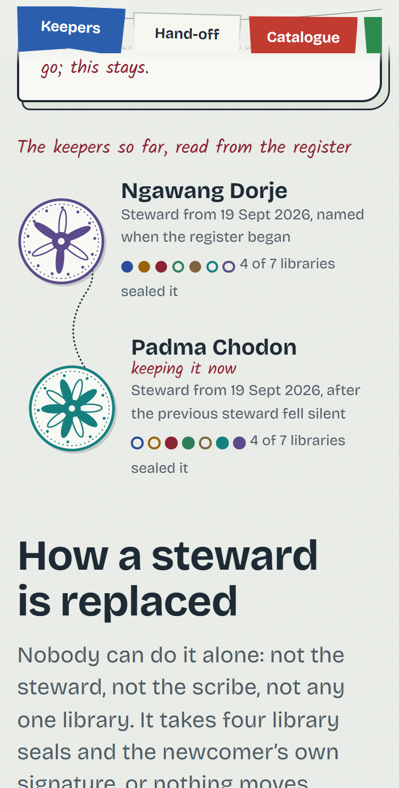
  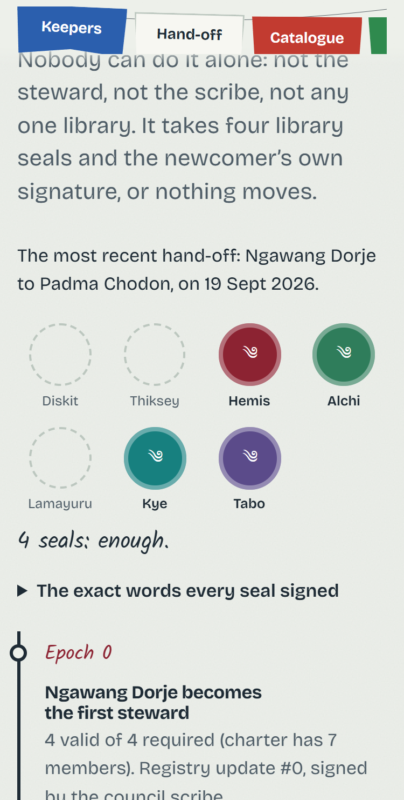
  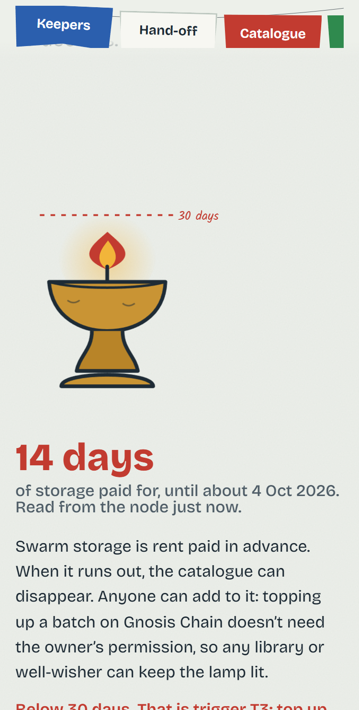
  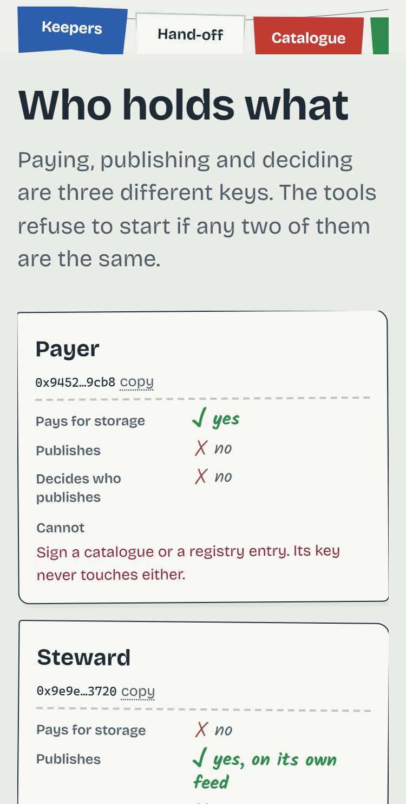
</p>
</details>

## The daily watchdog

A robot checks every day and raises its hand in public if the lamp is running low or the steward goes quiet. `npm run watchdog` reads only public facts from `stewardship.config.json` and a public gateway, needs no keys, and can't change or pay for anything. [`steward-watchdog.yml`](.github/workflows/steward-watchdog.yml) runs it daily with only `issues: write, contents: read`, and keeps **one** `Stewardship alert: …` issue open while a trigger is met, closing it when everything is clear.

<details>
<summary>What it checks, and how</summary>

`scripts/watchdog.ts` → [`src/core/watchdog.ts`](src/core/watchdog.ts) › `gatherFacts()`, `assess()`:

1. **Reachable?** Walks the register and re-checks every entry's seals with the same reader code as everyone else ([`src/core/resolve.ts`](src/core/resolve.ts) › `readRegistry()`, via the keyless `HttpFeedStore`), follows it to the current steward's catalogue, and checks the stable `/bzz/<manifest>/` address answers.
2. **Paid for?** Finds the batch in the gateway's public `GET /batches` and reads its `batchTTL`.
3. **Still published?** Takes the current steward's last `publishedAt` and evaluates **T2** (silence) and **T3** (storage under the floor) with the charter's own numbers, using [`src/core/triggers.ts`](src/core/triggers.ts) › `evaluateTriggers()`, the same function as `succession check-trigger`.

It prints a plain-language report followed by the permissionless top-up commands from [docs/MECHANISMS.md](docs/MECHANISMS.md#topping-up-from-your-own-wallet-no-node-no-permission) with the batch filled in. Exit **0** all clear, **1** a trigger is met, **2** reachability or storage could not be confirmed. An alert is an answer, not a failed run. Tests: `test/watchdog.test.ts`.

*Honest note:* the robot cannot see whether libraries' letters to the steward went unanswered, which is the second half of T2. It raises the alarm at 60 quiet days, and T2 is met once two libraries confirm (`npm run watchdog -- --unanswered 2`).
</details>

## Run it

**In two minutes, no node needed:**

```sh
npm ci
npm run ceremony -- --rehearse     # the whole story in memory: genesis, silence, 4 refusals, 2 hand-offs
npm test                           # 56 tests: quorum rules, refusals, reader indirection, feed indexes, docs, secrets
npm run dev:web                    # http://localhost:5175, pick "Rehearsal" and press "Begin the story"
```

`http://localhost:5175/?play=all` plays the whole rehearsal on arrival. `npm run check` runs typecheck, lint, tests, the web build, the rehearsal and the secret audit (what CI runs).

<details>
<summary><b>With a funded Bee node</b> (Swarm Desktop at <code>localhost:1633</code>)</summary>

```sh
npm run cli -- storage cost --days 14 --mb 5             # quote first (5 MB is plenty: the catalogue is ~100 kB)
npm run cli -- storage buy --mb 5 --days 14 --yes         # the PAYER (node wallet) buys a batch; waits until usable
npm run ceremony -- --live --yes --incoming steward-padma # keys → genesis → publish → corrections →
                                                          # extend storage → refusals → hand-off → successor publishes
npm run cli -- read                                       # keyless: registry → steward → catalogue
npm run verify:handoff -- handoffs/<date>-epoch-1.json    # re-check the evidence against the network
npm run audit:secrets
```

What it spends, at September 2026 prices: about 0.65 xBZZ for the batch and 0.05 xBZZ for the one-day extension (`--extend-days N` to change it). Everything else is stamped against the batch already bought. The live ceremony checks the batch is usable and the wallet can pay before it writes anything. It is resumable: each stage checks the network and is skipped if it already happened, and a hand-off whose evidence file was not written (run cut off) is rebuilt from the registry on the network. `--incoming` takes a steward key name or a 0x address (default `steward-padma`, or `LSC_INCOMING`). Or do every step by hand:

```sh
npm run cli -- keys init                                  # private keys → .secrets/ (git-ignored), addresses → config
npm run cli -- succession propose --incoming 0x… --next 0x… --trigger T2-silence
npm run cli -- succession sign --epoch 1 --as hemis       # or --library hemis --signature 0x… from any wallet
npm run cli -- succession accept --epoch 1 --as steward-padma
npm run cli -- succession handoff --epoch 1 --incoming 0x…
npm run cli -- catalogue publish --as steward-padma
npm run cli -- correction submit --as tabo --record TABO-0003 --set condition=damaged --note "water stain"
npm run cli -- storage extend --days 1 --yes              # or: storage topup --bzz 0.1 --yes
npm run cli -- succession check-trigger --unanswered 2
```
</details>

### Where to start reading

| If you are… | Read |
|---|---|
| a library committee | [STEWARDSHIP.md](STEWARDSHIP.md): the agreement, roles, triggers, what it can't protect against |
| a reader with no software from us | [docs/READ_WITHOUT_US.md](docs/READ_WITHOUT_US.md): `curl` and a byte layout |
| checking what's technically possible | [docs/MECHANISMS.md](docs/MECHANISMS.md): who can pay, publish and decide, with sources |
| checking the hand-off happened | [HANDOFF_LOG.md](HANDOFF_LOG.md), `handoffs/*.json`, `npm run verify:handoff` |
| checking storage is paid | [STORAGE_LOG.md](STORAGE_LOG.md), `ledger/storage.json`, `npm run cli -- storage status` |
| checking it is still alive today | `npm run watchdog`, and the daily [watchdog issue](https://github.com/Tan0610/p3-succession/issues/1) |

## How each check is met

<details>
<summary>The full code path for every check, with the test that pins it</summary>

| # | Check | Code path | What to open / run |
|---|---|---|---|
| 1 | **Readers reach current content through a pointer that survives a change of publisher** | `src/core/resolve.ts` › `readRegistry()` walks the registry feed (owner = council scribe, topic `lsc/registry/v1`) and keeps only entries with valid seals → `readCatalogue()` follows `entry.steward.address` to *that steward's own* catalogue feed → `resolveAll()`. The starting address (scribe + topic) never changes when the steward does. | Third-party read paths with no keys and no batch: `npm run cli -- read` (`src/node/commands.ts` › `read()`), `src/core/http-feedstore.ts` › `HttpFeedStore` (plain `fetch`, used by the web viewer, works against a public gateway), and `curl` in [docs/READ_WITHOUT_US.md](docs/READ_WITHOUT_US.md). Test: `test/succession.test.ts` › "readers follow the registry to whoever is steward now, from the same starting address". |
| 2 | **Paying and signing identities are configured separately and used by different paths** | Paying: `stewardship.config.json` › `payer.nodeAddress` + `payer.batchId` (the Bee node wallet, read by `src/node/storage.ts` › `payerAddress()`); the batch is only ever used as a *stamp* in `src/node/bee.ts` › `BeeFeedStore` (`stamp()` in `putJson`, `putCollection`, `writeRef`). Signing: keys in git-ignored `.secrets/keys/*.key` loaded by `src/node/keys.ts` › `loadIdentity()` and passed to `BeeFeedStore.writeRef(signer, …)` → `bee.feed.makeWriter(topic, new PrivateKey(signer))`. | `src/node/identities.ts` › `assertIdentitiesSeparated()` refuses any shared address (called by `keysInit()` and `handoff()` in `src/node/commands.ts`); `cataloguePublish()` refuses a steward key equal to the payer. Evidence files list both under `payer` and `identitiesSeparated`. |
| 3 | **Storage is extended or topped up through a reachable command, not only bought** | `npm run cli -- storage extend --days N --yes` → `cli/succession.ts` → `src/node/commands.ts` › `storageExtend()` → `src/node/storage.ts` › `extendBatch()` → `bee.storage.extendDuration(batchId, Duration.fromDays(N))` on the **existing** configured batch. `storage topup --bzz X --yes` → `topUpBatch()` → `bee.stamp.topUp()`. | The live ceremony calls `storageExtend()` at stage 5. Without the node: `PostageStamp.topUp` from any wallet, [two `cast` commands](docs/MECHANISMS.md#topping-up-from-your-own-wallet-no-node-no-permission) using the batch id in the anchor block. Every payment is appended to [STORAGE_LOG.md](STORAGE_LOG.md) and `ledger/storage.json` with the node's TTL before → after. |
| 4 | **One document names a specific successor and the triggering condition** | [STEWARDSHIP.md](STEWARDSHIP.md) §3, the `lsc:successor` block: the designated successor's name **and 0x key**, the current steward, and the triggers T1–T4 in the same paragraph (§4 spells the triggers out). Rendered by `src/node/config.ts` › `renderSuccessorBlock()` via `syncDocs()`, which runs on `keys init`, `storage buy/use`, every hand-off and at the end of the live ceremony. | `test/docs-and-secrets.test.ts` › "after the live ceremony every placeholder is replaced by a concrete 0x address" and "… no placeholder is left anywhere in the tracked documents". |
| 5 | **A completed hand-off is recorded, naming two distinct signing identities, with evidence** | `src/node/evidence.ts` › `writeHandoffRecord()` writes `handoffs/<date>-epoch-N.json` and appends [HANDOFF_LOG.md](HANDOFF_LOG.md): outgoing and incoming steward addresses, the incoming steward's acceptance signature, every library seal with its recovered signer, the registry **feed index**, entry reference, the scribe's signed chunk (address, owner, signature), the outgoing steward's last signed catalogue chunk and the incoming steward's first. The incoming address is also written to `stewardship.config.json` › `currentSteward` and `history[]`. | Both files are tracked (only `handoffs/rehearsals/` is ignored). `npm run verify:handoff -- handoffs/<file>` re-counts the seals and re-reads every chunk from the network. A run cut off mid-write is repaired by `src/node/commands.ts` › `recoverHandoffRecords()`. |
| 6 | **The authority that changes the publisher is not the publisher** | The registry belongs to the **council scribe**, not to any steward. `src/core/operations.ts` › `performHandoff()` writes only with 4 of 7 library seals (5 of 7 for anyone the outgoing steward did not name) plus the incoming steward's acceptance, checked by `src/core/signatures.ts` › `verifyQuorum()`. Readers re-check the same rules in `src/core/resolve.ts` › `checkEntry()`, so even the scribe cannot redirect them. | `test/succession.test.ts` › "the outgoing steward cannot write the registry: his key is not the scribe", "refuses 3 of 7", "an entry the scribe writes without seals is ignored by readers". The live ceremony performed two refusals and recorded them in the evidence. |
| 7 | **No key, mnemonic, gift code or credential URL in any tracked file** | `.gitignore` ignores `.secrets/`, `*.key` and `.env*`; `src/node/keys.ts` › `assertIgnored()` refuses to write a key where git would track it; keys never enter evidence (records are built from addresses only). `src/node/audit.ts` › `auditSecrets()` scans every tracked file for local key bytes, any 32-byte hex under a key-like name, literal keys passed to `Wallet`/`PrivateKey`, hex that derives to a role address, the published Hardhat/Anvil keys, 12-word phrases and credential URLs. | `npm run audit:secrets`; also a test, and the last stage of the live ceremony. Tests make every key at runtime (`Wallet.createRandom()`), and one checks that rehearsal output never serialises a private key. |
| 8 | **The succession path takes the incoming steward as a parameter** | `npm run cli -- succession handoff --epoch 1 --incoming 0x…` (or `LSC_INCOMING`) → `src/node/commands.ts` › `handoff({ incoming })` → `performHandoff({ incoming })`, which refuses if it differs from the signed statement (`INCOMING_MISMATCH`). The live ceremony takes `--incoming <steward key name or 0x address>` (and `--next`, `--first`). | `test/succession.test.ts` › "--incoming must match the signed statement (no hardcoded successor)". |

One subtle bee-js behaviour we avoided (feed writes with no explicit index treat any HTTP error as "empty feed"), and why each steward gets their own feed rather than inheriting a key, are explained in [docs/MECHANISMS.md](docs/MECHANISMS.md#what-that-means-for-the-design).
</details>

## Honest limits

- **Storage custody is not separated.** Everything runs on one shared Bee node, and every postage batch belongs to its wallet. Anyone can *top up* (it's permissionless on-chain), but only that node can stamp uploads. A second node with its own batch would be the real fix.
- **One person performed the whole demonstration.** All eleven keys (seven committees, three stewards, the scribe) were generated on one machine, in its git-ignored `.secrets/`. Every evidence file says so in its `honesty` field. In real use each library and steward generates their own key and shares only the address.
- **The T2 silence period was declared, not waited out.** The 60-day clock is exercised in the rehearsal and the tests; the live run records that the committees declared T2.
- **The demonstration batch is small and short-lived** (5 MB, 14 days, extended to 15). Below 30 days of paid storage, `storage status`, `check-trigger` and the daily watchdog report trigger T3 as met until someone tops it up. That is the arrangement working as written, not a bug.
- **The catalogue entries are illustrative sample data**, not a real inventory.
- **Losing the scribe key freezes the register** (the catalogue stays readable). Mirror registries kept by several libraries would remove that single point of failure. See [docs/MECHANISMS.md](docs/MECHANISMS.md#what-we-did-not-build-and-why).

## Stack

bee-js **13.1.0** (pinned exactly, v13 namespaced API), ethers 6.17.0 for human-readable EIP-191 seals, zod, commander, TypeScript 5.9, Vite 7 + React 19 for the read-only viewer, vitest. Node 22. [MIT licensed](LICENSE).
